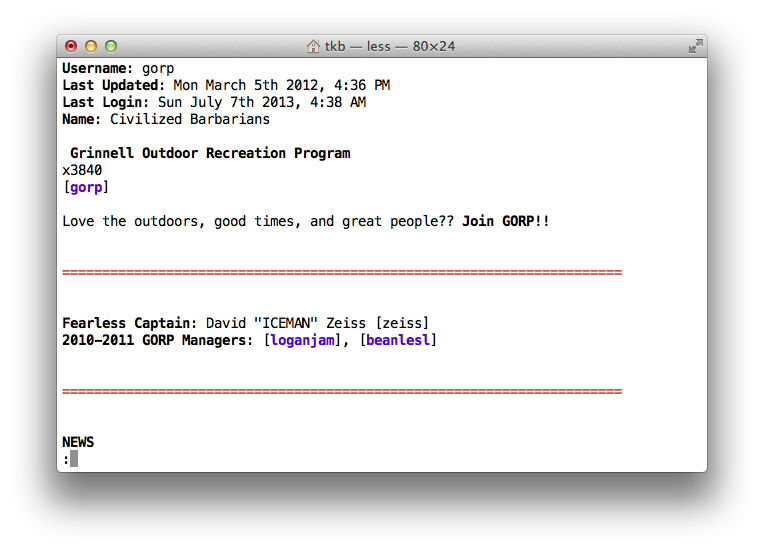

.. clans documentation master file, created by
   sphinx-quickstart on Tue Dec 25 19:44:41 2012.
   You can adapt this file completely to your liking, but it should at least
   contain the root `toctree` directive.

Command-line Plans (``clans``)
==============================

Clans is a command-line client for the GrinnellPlans_ social network.

.. _GrinnellPlans: http://grinnellplans.com/

Read the [gorp] plan:

.. code-block:: console

    $ clans read gorp

Check quick love:

.. code-block:: console

    $ clans love

Edit your plan in ``$EDITOR``:

.. code-block:: console

    $ clans edit

Not only does clans offer an alternative interface to Plans,
but it is also a useful tool for:

  - automatically backing up your plan
  - scheduling a plan update for a later time
  - emailing yourself when new planlove arrives

and much more. No Limits™!

Contents
========

.. toctree::
   :maxdepth: 2

   install
   usage
   configuration
   extensions
   hooks
   cookbook

Indices and tables
==================

* :ref:`genindex`
* :ref:`modindex`
* :ref:`search`

